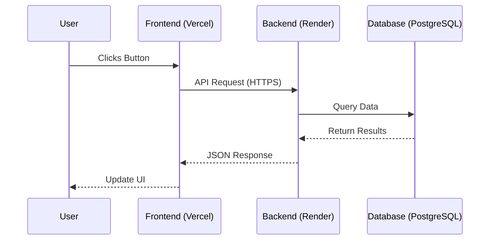

# Deployment Guide

This project is configured for deployment using **Render** (Backend) and **Vercel** (Frontend).

## Prerequisites

1.  **Push to GitHub**: Ensure all your code is pushed to your GitHub repository.
    ```bash
    git add .
    git commit -m "Prepare for deployment"
    git push origin main
    ```

## 1. Backend Deployment (Render)

1.  Go to [Render Dashboard](https://dashboard.render.com/).
2.  Click **New +** -> **Web Service**.
3.  Connect your GitHub repository.
4.  Configure the service:
    *   **Name**: `edu2job-backend` (or similar)
    *   **Root Directory**: `backend`
    *   **Runtime**: `Python 3`
    *   **Build Command**: `./build.sh`
    *   **Start Command**: `gunicorn core.wsgi:application`
5.  **Environment Variables**:
    *   `PYTHON_VERSION`: `3.9.0` (or your local version)
    *   `SECRET_KEY`: (Generate a strong random string)
    *   `DEBUG`: `False`
    *   `ALLOWED_HOSTS`: `*` (or your frontend domain later)
    *   `GEMINI_API_KEY`: (Your Google Gemini API Key)
    *   `CORS_ALLOW_ALL_ORIGINS`: `True` (or `False` if setting specific origins)
    *   `CSRF_TRUSTED_ORIGINS`: `https://your-frontend.vercel.app` (add this after deploying frontend)
6.  **Database**:
    *   Render offers a managed PostgreSQL database. Create one and link it to your Web Service. Render will automatically set the `DATABASE_URL` environment variable.
    *   *Note*: If you stick with the free tier, the database might expire after 30 days. For persistent data, upgrade the plan or use an external provider like Supabase.

## 2. Frontend Deployment (Vercel)

1.  Go to [Vercel Dashboard](https://vercel.com/dashboard).
2.  Click **Add New...** -> **Project**.
3.  Import your GitHub repository.
4.  Configure the project:
    *   **Root Directory**: `frontend`
    *   **Framework Preset**: Vite
    *   **Build Command**: `npm run build`
    *   **Output Directory**: `dist`
5.  **Environment Variables**:
    *   `VITE_API_BASE_URL`: The URL of your deployed Render backend (e.g., `https://edu2job-backend.onrender.com`).
        *   *Important*: Do not add a trailing slash `/`.
6.  Click **Deploy**.

## 3. Final Steps

1.  Once the Frontend is deployed, copy its URL (e.g., `https://edu2job-frontend.vercel.app`).
2.  Go back to Render Backend settings -> Environment Variables.
3.  Update (or add) `CSRF_TRUSTED_ORIGINS` to include your frontend URL.
4.  (Optional) Set `CORS_ALLOW_ALL_ORIGINS` to `False` and add `CORS_ALLOWED_ORIGINS` with your frontend URL.

## 4. Architecture & Data Flow

Understanding how data moves through your application:

### The Components
1.  **Frontend (Vercel)**: The React website users see in their browser (`https://edu2-job.vercel.app`).
2.  **Backend (Render Web Service)**: The Django API that processes logic (`https://edu2job-backend-bl03.onrender.com`).
3.  **Database (Render PostgreSQL)**: Where data (users, predictions) is stored.

### The Flow
1.  **User Action**: A user clicks "Login" on your Frontend.
2.  **Request**: The Frontend sends an HTTPS request (e.g., `POST /api/login/`) to your Backend URL.
    *   *Security*: This is allowed because you configured `CORS_ALLOWED_ORIGINS` on the Backend.
3.  **Processing**:
    *   Django receives the request.
    *   It checks the **Database** to verify username/password.
    *   The Database returns the user data to Django.
4.  **Response**: Django sends a JSON response (e.g., `{ token: "abc...", user: "John" }`) back to the Frontend.
5.  **Display**: The Frontend receives the data and updates the screen (e.g., redirects to Dashboard).

### Diagram

